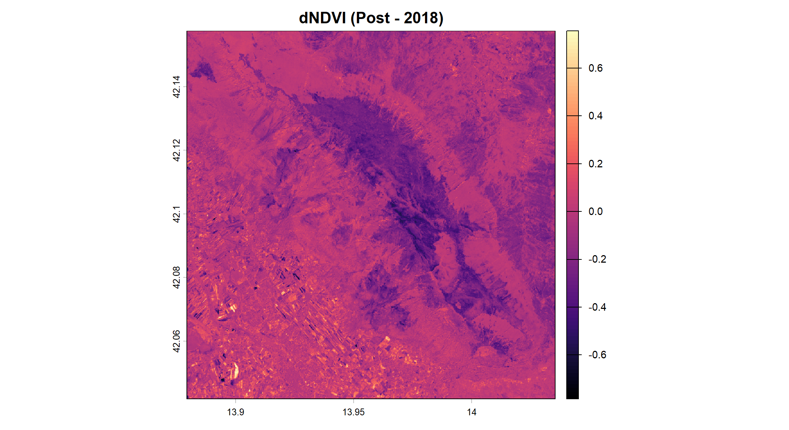
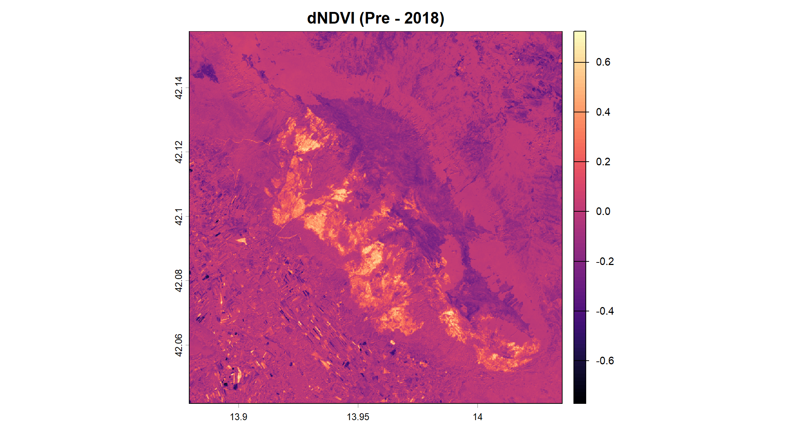
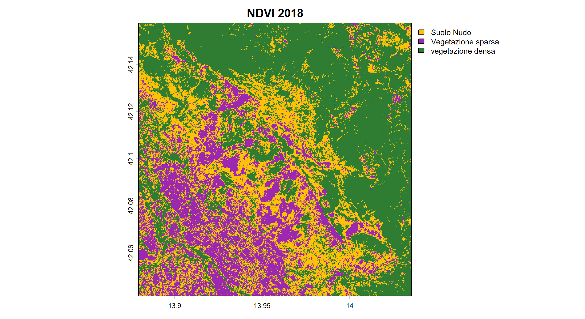
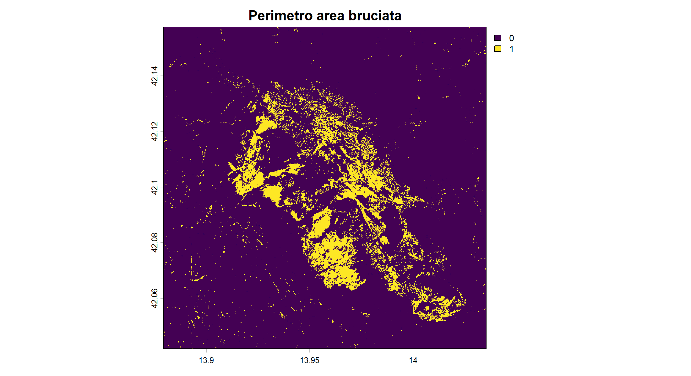
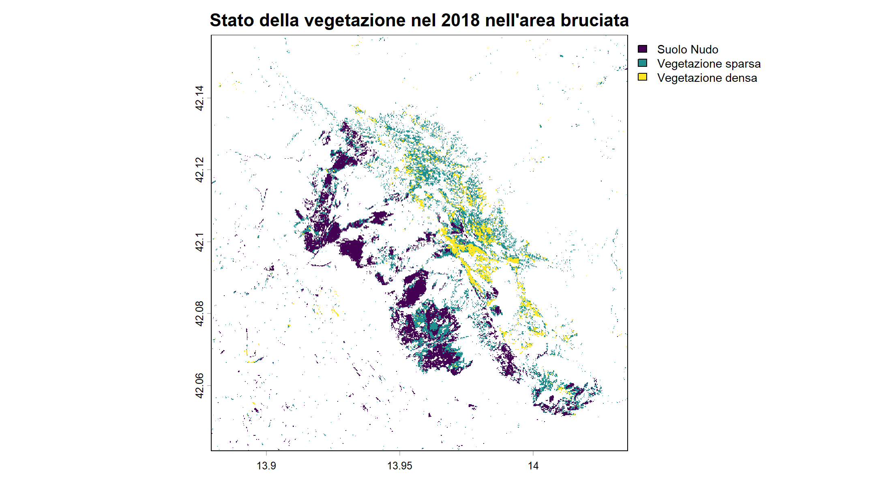

# INCENDIO SUL MONTE MORRONE - Parco Nazionale della Maiella (Abruzzo) 🔥
### Esame di Telerilevamento Geo-Ecologico in R - 2026
#### Sabrina Montanari
# 1. Introduzione
L'incendio boschivo divampato nell'estate 2017, tra fine agosto e inizio settembre, ha colpito il **Monte Morrone**, situato all'interno del **Parco Nazionale della Maiella** in Abruzzo. L'evento ha distrutto oltre 2.000 ettari di copertura forestale, danneggiando gravemente popolamenti di pino nero e faggete di elevato valore ecologico. 

 > Monte Morrone
<p align="center">
 
</p>

In questo progetto analizziamo l'impatto dell'incendio sulla vegetazione nell'area dell'Appennino centrale, attraverso immagini satellitari **Sentinel-2** in tre momenti temporali:
- Pre-incendio: 1 Luglio 2017 – 15 Agosto 2017 (condizione della vegetazione precedente all'incendio)
- Post-incendio: 15 Settembre 2017 – 15 Ottobre 2017 (situazione subito dopo l'estinzione del rogo)
- Un anno dopo: Luglio 2018
> 📍 Area di studio (Monte Morrone - Parco della Maiella)
<p align="center">
 
</p>

# 2. Obiettivo
L'obiettivo dello studio è analizzare le variazioni spettrali indotte dall'incendio del 2017 sulla copertura vegetale nel Parco Nazionale della Maiella, confrontando le immagini satellitari Sentinel-2 prima e dopo l'evento, e valutando il grado di rigenerazione vegetazionale ad un anno di distanza dal rogo.
## Sono stati calcolati i seguenti indici vegetazionali:
- DVI (Difference Vegetation Index) – quantità assoluta di vegetazione
- NDVI (Normalized Difference Vegetation Index) – salute della vegetazione

# 3. Metodologia
Le immagini satellitari sono state scaricate da [**Google Earth Engine**](https://earthengine.google.com/), utilizzando il codice Java script fornito durante il corso e in seguito modificato per ottenere l'area e le date di interesse.
### Installazione dei pacchetti
Una volta impostata la working directory con `setwd()`, sono stati installati i pacchetti in R necessari alle analisi:
```r
setwd("C:\\Teleril_GEE_exports")
getwd()
list.files()
# Pacchetti utilizzati
library(terra)     # Per lavorare con raster e immagini satellitari
library(imageRy)   # Per l'analisi semplificata di immagini raster/satellitari
library(viridis)   # Per palette di colori di grafici e mappe
library(ggplot2)   # Per la creazione di grafici
library(patchwork) # Per unire più grafici in un unico layout
```
### Importazione delle immagini
Per importare i dati è stata utilizzata la funzione `rast()` del pacchetto `terra` e le immagini sono state rinominate:
> I raster caricati presenta le bande spettrali disposte secondo la sequenza: [B2: Blu, B3: Verde, B4: Rosso, B8: NIR]
```r
pre <- rast("sentinel2_median_2026_pre.tif")
plot(pre)
```
> Immagine prima dell'incendio nelle 4 bande
<p align="center">
 
</p>

```r
post <- rast("sentinel2_median_2026_post.tif")
plot(post)
```
> Immagine dopo l'incendio nelle 4 bande
<p align="center">
 
</p>

### Analisi esplorativa
### - Visualizzazione delle immagini in RGB (colori reali)
Per farlo utilizzo la funzione `im.plotRGB()` del pacchetto `imageRy`:
```r
im.multiframe(1, 2)  # visualizza due grafici sulla stessa riga
 im.plotRGB(pre, r=3, g=2, b=1, title="pre-indendio")
 im.plotRGB(post, r=3, g=2, b=1, title="post-indendio")
```
<p align="center">
 
</p>

### - Visualizzazione in Falso Colore Infrarosso (NIR-Red-Green)
Per evidenziare visivamente l'impatto dell'incendio sulla copertura vegetale, è stata generata una composizione in falso colore:
```r
im.multiframe(1, 2) 
 im.plotRGB(pre, r=4, g=3, b=2, title="pre")
 im.plotRGB(post, r=4, g=3, b=2, title="post")
```
> **Commento:**
> Dopo l'incendio la vegetazione (in rosso) risulta ridotta sul versante ovest del monte Morrone, maggiormente colpito dal rogo.
<p align="center">
 
</p>

### - Visualizzazione e confronto delle singole bande spettrali (B2, B3, B4, B8)
Utilizzo il pacchetto `viridis` e la palette di colori `magma` per analizzare le variazioni di riflettanza pre e post-incendio:
```r
png("Bande.png", width = 2200, height = 1200, res = 220)  # salva il file direttamente su disco impostandone risoluzione e dimensioni
 im.multiframe(2, 4)
 par(mar = c(2.5, 2.5, 2, 0.5))  # riduce i margini esterni attorno a ciascun grafico
 # PRE
 plot(pre[[1]], col = magma(100), main = "Pre - Blue (B2)", cex.main = 0.8) 
 plot(pre[[2]], col = magma(100), main = "Pre - Green (B3)", cex.main = 0.8)
 plot(pre[[3]], col = magma(100), main = "Pre - Red (B4)", cex.main = 0.8)
 plot(pre[[4]], col = magma(100), main = "Pre - NIR (B8)", cex.main = 0.8)
 # POST
 plot(post[[1]], col = magma(100), main = "Post - Blue (B2)", cex.main = 0.8)
 plot(post[[2]], col = magma(100), main = "Post - Green (B3)", cex.main = 0.8)
 plot(post[[3]], col = magma(100), main = "Post - Red (B4)", cex.main = 0.8)
 plot(post[[4]], col = magma(100), main = "Post - NIR (B8)", cex.main = 0.8)
dev.off()
```
<p align="center">
 
</p>

>**Commento:**
>- Nei grafici della banda del Rosso (B4) si osserva, nella fase *Pre-incendio*, una bassa riflettanza dovuta al forte assorbimento della luce da parte della clorofilla per la fotosintesi. Nella fase *Post-incendio* si registra un aumento della riflettanza a causa della scomparsa dei pigmenti fotosintetici e dell'esposizione del suolo bruciato.
>-  Nel grafico del Vicino Infrarosso (B8) viene rilevato in modo più netto l'impatto dell'incendio. Nella fase *Pre-incendio* la vegetazione sana presenta alti valori di riflettanza (aree chiare/gialle) dovuti alla struttura cellulare delle foglie, mentre nella fase *Post-incendio* si osserva un crollo della riflettanza (area scura/viola), causato dalla perdita di biomassa fotosinteticamente attiva e dalla presenza di cenere/suolo bruciato.

# 4. Calcolo degli inidici vegetazionali 🌿

## Indice DVI
L'indice spettrale DVI (*Difference Vegetation Index*) permette di stimare la quantità della biomassa vegetale, calcolando la differenza algebrica tra la riflettanza nel Vicino Infrarosso (NIR) e la riflettanza nel Rosso (RED).
> Alti valori di DVI sono indici di una vegetazione sana e densa (alta riflettanza dell'infrarosso).
>
$$
DVI = NIR - RED
$$
>
Sono stati calcolati i DVI della fase pre e post incendio:
```r
dvi_pre <- pre[[4]] - pre[[3]]      # min: -0.069; max: 0.77
dvi_post <- post[[4]] - post[[3]]   # min: -0.062; max: 1.02
```
Successivamente è stata calcolata la variazione multitemporale, il **dDVI**:
> Alti valori di dDVI indicano un crollo del DVI tra il prima e il dopo.
```r
dDVI <- dvi_pre - dvi_post          # min: -0.40; max: 0.61 
```
> **Commento:**
> L'area presenta una netta eterogeneità: mentre la vegetazione indisturbata ha continuato la sua crescita (portando il DVI massimo oltre 1.0), le zone interessate dal fuoco hanno subito un crollo del segnale spettrale, evidenziato da valori di dDVI fortemente positivi (fino a **+0.61**).

Visualizzazione dei plot con la palette `viridis` per i DVI pre e post incendio e la palette `magma` per il dDVI:
```r
im.multiframe(1, 3)
par(mar = c(3, 3, 3, 1))
 plot(dvi_pre, col = viridis(100), main = "DVI Pre")
 plot(dvi_post, col = viridis(100), main = "DVI Post")
 plot(dDVI, col = magma(100), main = "dDVI (Pre - Post)")
```
<p align="center">
 
</p>

> **Commento:**
> * La mappa *Post-incendio* appare molto più scura al centro (viola/blu) indicando una drastica riduzione del DVI corrispondente alla perdita di biomassa vegetale e alla presenza di cenere e suolo bruciato.
> * Nella mappa del *dDVI*, le aree gialle/chiare (+0.4/+0.6) mostrano dove il DVI è crollato tra il prima e il dopo, permettendo di perimetrare meglio le aree bruciate (cicatrice dell'incendio).


## Indice NDVI
L'indice NDVI (*Normalized Difference Vegetation Index*) rappresenta un indice DVI normalizzato, che riduce i disturbi dovuti a variazioni di illuminazione solare, ombre topografiche e pendenze del terreno (valori compresi tra -1 e +1).
> Alti valori di NDVI sono indici di una vegetazione sana; valori negativi o tendenti a zero indicano una vegetazione degradata o suolo nudo.
> 
$$
NDVI = \frac{NIR - RED}{NIR + RED}
$$
>
Per il calcolo dell'NDVI pre e post incendio è stata usata la funzione `im.ndvi()` del pacchetto `imageRy`:
```r
ndvi_pre <- im.ndvi(pre, 4, 3)
ndvi_post <- im.ndvi(post, 4, 3)
```
In seguito è stata calcolata la variazione multitemporale, $dNDVI = NDVI_{pre} - NDVI_{post}$, per mappare con precisione il perimetro del suolo bruciato e valutare il danno subito dall'ecosistema forestale:
```r
dNDVI <- ndvi_pre - ndvi_post
```
Visualizzazione dei grafici con la palette `viridis` per gli indici NDVI pre e post incendio e la palette `magma` per il dNDVI:
```r
im.multiframe(1, 3)
par(mar = c(3, 3, 3, 1))
 plot(ndvi_pre, col = viridis(100), main = "NDVI Pre")
 plot(ndvi_post, col = viridis(100), main = "NDVI Post")
 plot(dNDVI, col = magma(100), main = "dNDVI (Pre - Post)")
```
<p align="center">
 
</p>

>**Commento:**
> Nella mappa *Post-incendio* si nota un drastico abbassamento dei valori di NDVI, compresi tra **0.0 e 0.3** (verde scuro/blu) rispetto alla mappa *Pre-incendio*.
> La mappa *dNDVI* mostra le aree non colpite dal fuoco con colori scuri (valori prossimi allo zero), mentre l'intera **cicatrice dell'incendio** risalta con tonalità chiare e accese (**dNDVI > +0.4**).

## Classificazione dei dati NDVI
Per visualizzare il tipo di copertura del suolo e la sua variazione dopo l'evento incendiario, è stata effettuata una classificazione *non supervisionata* della mappa. A tal fine, è stata utilizzata la funzione `im.classify()` del pacchetto `imageRy`, che suddivide i pixel in tre gruppi coerenti dal punto di vista spettrale (`num_clusters = 3`):
```r
ndvi_pre_c <- im.classify(ndvi_pre, num_clusters = 3, seed = 1)  # suddivisione dei pixel in tre *clusters*
ndvi_post_c <- im.classify(ndvi_post, num_clusters = 3, seed = 1)
```
Le tre classi create sono state rinominate attraverso la funzione `levels()`, in base al **valore medio di NDVI**, in:
  - Suolo Nudo (valori medi prossimi allo 0)
  - Vegetazione sparsa (valori medi intermedi)
  - Vegetazione densa (valori medi elevati)
```r
levels(ndvi_pre_c) <- data.frame(
  value = c(1:3),
  label = c("Suolo Nudo", "Vegetazione sparsa", "Vegetazione densa")
)
levels(ndvi_post_c) <- data.frame(
  value = c(1:3),
  label = c("Suolo Nudo", "Vegetazione sparsa", "Vegetazione densa")
)
```
Creo una palette di colori da utilizzare nelle mappe:
```r
palette <- c("#FFC107", "#9C27B0", "#2E7D32")
```
Visualizzazione dei dati NDVI classificati:
```r
plot(ndvi_pre_c, main = "NDVI Pre", col = palette, legend = FALSE)
plot(ndvi_post_c, main = "NDVI Post", col = palette, cex.legend = 0.8)
```
 
>**Commento:**
> Dal confronto dei grafici è evidente l'aumento delle aree con vegetazione degradata/suolo nudo in seguito al rogo.

## Frequenze e Percentuali di copertura
È stata calcolata la copertura percentuale per ogni classe:
```r
freq_pre <- freq(ndvi_pre_c)  # conta i pixel per ogni classe
perc_pre <- freq_pre$count * 100 / ncell(ndvi_pre_c)  # calcola la percentuale di pixel per classe

freq_post <- freq(ndvi_post_c) 
perc_post <- freq_post$count * 100 / ncell(ndvi_post_c)
```
Realizzazione della tabella riassuntiva:
```r
tab <- data.frame(
  class=c("suolo nudo", "vegetazione sparsa", "vegetazione densa"),
  perc_pre = round(perc_pre, 1),
  perc_post = round(perc_post, 1)
)
```
## Grafico a barre della copertura percentuale 📊
Sono stati utilizzati i pacchetti `ggplot2` e `patchwork` per realizzare e visualizzare i grafici a barre relativi alle diverse coperture in percentuale delle tre classi, prima e dopo l'incendio.
```r
#Pre
g1 <- ggplot(tab, aes(x = class, y = perc_pre, color = class)) +    
  geom_bar(stat = "identity", fill = "white", show.legend = FALSE) +        # grafico a barre, stat="" definisce la statistica da usare
  ylim(c(0, 100)) +
  labs(title = "Pre-Incendio", y = "Percentuale (%)") +
  theme(axis.text.x = element_blank(), axis.ticks.x = element_blank())  # rimuove il testo sotto l'asse x
#Post
g2 <- ggplot(tab, aes(x = class, y = perc_post, color = class)) +
  geom_bar(stat = "identity", fill = "white") +
  ylim(c(0, 100)) +
  labs(title = "Post-Incendio", y = "Percentuale (%)") +
  theme(axis.text.x = element_blank(), axis.ticks.x = element_blank())

g1 + g2   # visualizza i grafici in un unico layout
```

> Grafico comparativo pre/post-incendio: è evidente un leggero aumento del suolo nudo e una diminuzione della vegetazione.
<p align="center">
 
</p>

# 5. Analisi dopo un anno dall'incendio - Luglio 2018
Per studiare se la vegetazione sia tornata al suo stato di salute originale (pre-incendio), è stata analizzata un'immagine satellitare corrispondente al periodo di luglio 2018.
Il procedimento è identico a quello precedente:

### Importazione e analisi dell'immagine
```r
post18 <- rast("sentinel2_jul2018.tif")
plot(post18)
```
Visualizzazione del grafico in False colors:
```r
im.plotRGB(post18, r=4, g=3, b=2, title="False colors 2018")
```
       

### Indice DVI
È stato calcolato l'indice DVI per il 2018 e la variazione multitemporale rispetto alla fase pre-incendio (`dDVI2`):
```r
dvi_post18 <- post18[[4]] - post18[[3]]
dDVI2 <- dvi_pre - dvi_post18

# Layout
png("dvi2018.png", width = 2200, height = 1200, res = 220)
 im.multiframe(1, 3)
 par(mar = c(3, 3, 3, 1))
 plot(dvi_pre, col = viridis(100), main = "DVI Pre")
 plot(dvi_post18, col = viridis(100), main = "DVI 2018")
 plot(dDVI2, col = magma(100), main = "dDVI (Pre - 2018)")
dev.off()
```
<p align="center">
 
</p>

## Indice NDVI - 2018
È stato calcolato l'indice NDVI per il 2018 con la funzione `im.ndvi()`:
```r
ndvi_post18 <- im.ndvi(post18, 4, 3)
plot(ndvi_post18, col = viridis(100), main = "NDVI 2018")
```
<p align="center">
 
</p>

Successivamente sono state confrontate le differenze spettrali dell'NDVI tra **Pre vs 2018** (`dNDVI2`) e **Post vs 2018** (`dNDVI3`):
``` r
# Pre vs 2018
dNDVI2 <- ndvi_pre - ndvi_post18
png("pre-2018.png", width = 2200, height = 1200, res = 220)
  plot(dNDVI2, col = magma(100), main = "dNDVI (Pre - 2018)", cex.main = 1.2)
dev.off()
# Post vs 2018
dNDVI3 <- ndvi_post - ndvi_post18
png("post-2018.png", width = 2200, height = 1200, res = 220)
  plot(dNDVI3, col = magma(100), main = "dNDVI (Post - 2018)", cex.main = 1.2)
dev.off()
```
> **Commento:**
> Nella mappa della differenza di NDVI *Post - 2018*, la quasi totalità dell'area colpita assume tonalità scure (valori negativi) che indicano un aumento di vegetazione fotosinteticamente attiva (NDVI_2018 > NDVI_2017).
> Tuttavia, se il confronto viene fatto con la fase *pre-incendio* (dNDVI Pre-2018), l'area interessata dal rogo è evidenziata da colori chiari (valori positivi) indici di una ripresa lenta della vegetazione che non ha ancora ripristinato lo stato precedente all'evento.

 

## Classificazione NDVI 2018
È stat eseguita la classificazione non supervisionata sull'immagine del 2018 per identificare le tre macro-classi di copertura:
```r
ndvi_18_c <- im.classify(ndvi_post18, num_clusters = 3, seed = 1)
```
Successivamente, poichè i cluster risultavano invertiti, sono stati riordinati per uniformarli tra le fasi Pre e Post-evento, utilizzando la funzione di Base R `matrix()` e la funzione `classify()` del pacchetto `terra`:
```r
m_reorder <- matrix(c(1, 2,                         # matrice di riclassificazione: riordina i valori numerici del raster
                      2, 1,                         # inverte la classe 1 e la classe 2
                      3, 3), ncol = 2, byrow = TRUE)
ndvi_18_fixed <- classify(ndvi_18_c, m_reorder)     # applica la matrice (m_reorder) al raster di partenza (ndvi_18_c).

levels(ndvi_18_fixed) <- data.frame(                # Rinomino le classi
  value = 1:3,
  label = c("Suolo Nudo", "Vegetazione sparsa", "Vegetazione densa")
)
```
Visualizzazione della mappa del 2018 classificata:
```r
png("class_2018.png", width = 2200, height = 1200, res = 220)
  plot(ndvi_18_fixed, main = "NDVI 2018", col = palette, cex.legend = 0.8)
dev.off()
```
<p align="center">
 
</p>

> **Commento:**
> Dalla mappa classificata del 2018 si osserva un parziale aumento della vegetazione rispetto al periodo *post-incendio*.

## Frequenze e percentuali di copertura (NDVI 2018)
È stata calcolata la copertura percentuale delle tre classi, sull'intera immagine raster, per tutti i periodi analizzati:
```r
freq_18 <- freq(ndvi_18_fixed) 
perc_18 <- freq_18$count * 100 / ncell(ndvi_18_fixed)

tab <- data.frame(
  class=c("suolo nudo", "vegetazione sparsa", "vegetazione densa"),
  perc_pre = round(perc_pre, 1),
  perc_post = round(perc_post, 1),
  perc_18 = round(perc_18, 1)
)
print(tab)
```
Tabella relativa alla copertura percentuale nei tre periodi considerati:
| Classe | % pre | % post | % 2018 |
|:--| :--: | :--:| :--:|
| **suolo nudo**  |   24.5  | 27.2 | 21.2 |
| **vegetazione sparsa**   |  33.7  | 32.7 | 29.2 |
|  **vegetazione densa**  |   41.8  | 40.1 |  49.6 |

> **Commento:**
> Il calcolo delle percentuali di copertura del suolo sull'intera immagine mostra, a distanza di un anno, una riduzione del suolo nudo e un aumento significativo della vegetazione densa.
> ⚠ Tuttavia, questa statistica globale considera anche i versanti non colpiti dal fuoco. Per valutare il reale stato di recupero dell'incendio è necessario isolare spazialmente la sola area bruciata.

# 6. Analisi della rigenerazione vegetazionale (sola area bruciata) 🌳
Per evitare distorsioni causate da aree non colpite dall'incendio o da suoli nudi permanenti (es. infrastrutture, rocce), è stata condotta la valutazione del recupero ad un anno, esclusivamente all'interno della cicatrice dell'incendio del 2017.

### - Identificazione della sola area bruciata nel 2017 🔥
È stata applicata la logica del ciclo *if/else* attraverso la funzione vettorializzata `ifel()` del pacchetto `terra`, per definire il perimetro esatto del danno.
Essa permette di lavorare sulla matrice di pixel del raster, estraendo solo i pixel che prima dell'evento erano vegetati (valore >1) e subito dopo sono diventati suolo nudo (valore ==1)
>
```r
area_bruciata <- ifel(ndvi_pre_c > 1 & ndvi_post_c == 1, 1, 0)
```
> **Commento:**
>  Se la transizione del pixel è da Vegetazione Sparsa (2) o Densa (3) a Suolo Nudo (1), allora assegna al pixel il valore 1 (Bruciato), altrimenti 0 (Non bruciato).
>
Visualizzazione dell'area bruciata:
```r
png("areabruciata.png", width = 2200, height = 1200, res = 220)
  plot(area_bruciata, main = "Perimetro area bruciata")
dev.off()
```
<p align="center">
 
</p>

### - Isolamento dello stato della vegetazione nel 2018
Per limitare l'analisi del 2018 solo ed esclusivamente ai pixel dove si è verificato l'incendio nel 2017, è stata usata la funzione `mask()`.
Con questa funzione sono stati estratti dal raster classificato del 2018 (*ndvi_18_fixed*) solo i pixel che si trovano all'interno del perimetro dell'incendio definito precedentemente (*area_bruciata*). 
>
> Con il comando `maskvalues = 0`, tutti i pixel esterni al rogo (valore = 0) vengono convertiti in *valori nulli* (NA).
```r
ripresa_2018 <- mask(ndvi_18_fixed, area_bruciata, maskvalues = 0)

png("ripresa_2018.png", width = 2200, height = 1200, res = 220)
  plot(ripresa_2018, main = "Stato della vegetazione nel 2018 nell'area bruciata")
dev.off()
```
<p align="center">
 
</p>

### - Calcolo delle percentuali di rigenerazione
Per il calcolo percentuale è stata usata la funzione `sum(freq_ripresa$count)` che conta solo i pixel validi (area bruciata), escludendo dal totale i pixel nulli situati al di fuori della maschera di analisi:
```r
freq_ripresa <- freq(ripresa_2018)
perc_ripresa <- freq_ripresa$count * 100 / sum(freq_ripresa$count)
```
Tabella riassuntiva:
```r
tab_ripresa <- data.frame(
  classe = c("Mancata Rigenerazione (Suolo Nudo)", 
             "Rigenerazione Parziale (Veg. Sparsa)", 
             "Rigenerazione Completa (Veg. Densa)"),
  percentuale = perc_ripresa
)
print(tab_ripresa)
```
| Classe | Percentuale |
|:--| :--: |
| Mancata Rigenerazione (Suolo Nudo) | 42.4 % |
| Rigenerazione Parziale (Veg. Sparsa) | 43.5 % |
| Rigenerazione Completa (Veg. Densa) | 14.1 % |

# 7. CONCLUSIONI
L'analisi multitemporale basata sugli indici di vegetazione NDVI ha permesso di quantificare con precisione l'impatto dell'incendio del 2017 e la successiva dinamica di ripristino vegetazionale a distanza di un anno. L’evento, nell'immediato ha causato una drastica transizione delle superfici da copertura forestale a suolo nudo, evidenziato dal crollo dell'dNDVI.
>
Ad un anno di distanza dall'incendio, il **57.6%** della superficie colpita (somma di vegetazione sparsa 43.5% e densa 14.1%) ha mostrato un processo attivo di **ripresa fotosintetica**, guidato principalmente dallo sviluppo di vegetazione erbacea e arbustiva di ricolonizzazione (*Vegetazione Sparsa*).
>
Il **42.4%** dell'area risulta, però, ancora in uno stato di *Mancata Rigenerazione* (**Suolo Nudo**), evidenziando le zone in cui il danno è stato severo e la risposta della copertura vegetale necessita di tempi di ripristino più lunghi.
