# INCENDIO SUL MONTE MORRONE - Parco Nazionale della Maiella (Abruzzo)
### Esame di Telerilevamento Geo-Ecologico in R - 2026
#### Sabrina Montanari
# 1. Introduzione
L'incendio boschivo divampato nell'estate 2017, tra fine agosto e inizio settembre, ha colpito il **Monte Morrone**, situato all'interno del **Parco Nazionale della Maiella** in Abruzzo. L'evento ha distrutto oltre 2.000 ettari di copertura forestale, danneggiando gravemente popolamenti di pino nero e faggete di elevato valore ecologico. 

 > Monte Morrone
<p align="center">
 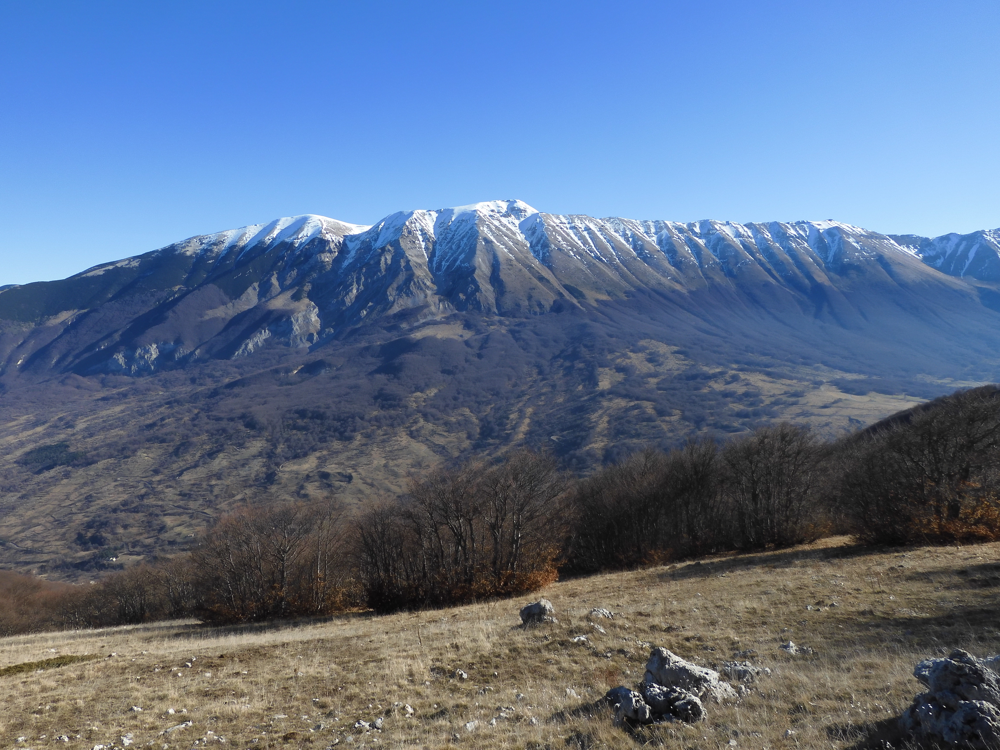
</p>

In questo progetto analizziamo l'impatto dell'incendio sulla vegetazione nell'area dell'Appennino centrale, attraverso immagini satellitari **Sentinel-2** in due momenti temporali:
- Pre-incendio: 1 Luglio 2017 – 15 Agosto 2017 (condizione della vegetazione precedente all'incendio)
- Post-incendio: 15 Settembre 2017 – 15 Ottobre 2017 (situazione subito dopo l'estinzione del rogo)

> Area di studio (Monte Morrone - Parco della Maiella)
<p align="center">
 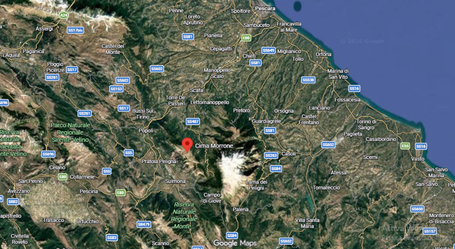
</p>

# 2. Obiettivo
Analizzare e quantificare le variazioni spettrali indotte dall'incendio del Monte Morrone sulla copertura vegetale, confrontando le acquisizioni satellitari Sentinel-2 prima e dopo l'evento.
## Sono stati calcolati i seguenti indici vegetazionali:
- DVI (Difference Vegetation Index) – quantità assoluta di vegetazione
- NDVI (Normalized Difference Vegetation Index) – salute della vegetazione
- NBR (Normalized Burn Ratio) – aree bruciate

# 3. Metodologia
Le immagini satellitari sono state scaricate da [**Google Earth Engine**](https://earthengine.google.com/), utilizzando il codice Java script fornito durante il corso e in seguito modificato per ottenere l'area e le date di interesse.
### Installazione dei pacchetti
Una volta impostata la working directory, sono stati installati i pacchetti in R necessari alle analisi:
```r
setwd("C:\\Teleril_GEE_exports")
getwd()
list.files()
# Pacchetti
library(terra)     # Per lavorare con raster e immagini satellitari
library(imageRy)   # Per l'analisi semplificata di immagini raster/satellitari
library(viridis)   # Per palette di colori di grafici e mappe
library(ggplot2)   # Per la creazione di grafici
library(patchwork) # Per unire più grafici in un unico layout
```
### Importazione delle immagini
Per importare i dati è stata utilizzata la funzione `rast()` del pacchetto `terra` e le immagini sono state rinominate:
```r
pre <- rast("sentinel2_median_2026_pre.tif")
plot(pre)
```
> Immagine prima dell'incendio nelle 4 bande (B2, B3, B4, B8)
<p align="center">
 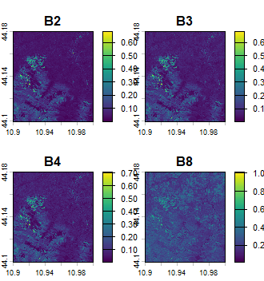
</p>

```r
post <- rast("sentinel2_median_2026_post.tif")
plot(post)
```
> Immagine dopo dell'incendio nelle 4 bande (B2, B3, B4, B8)
<p align="center">
 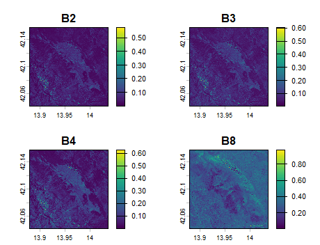
</p>

### Analisi esplorativa
### - Visualizzazione delle immagini in RGB (colori reali)
Per farlo utilizzo la funzione `im.plotRGB()` del pacchetto `imageRy`
```r
im.multiframe(1, 2)  # visualizza due grafici sulla stessa riga
im.plotRGB(pre, r=3, g=2, b=1, title="pre-indendio")
im.plotRGB(post, r=3, g=2, b=1, title="post-indendio")
```
<p align="center">
 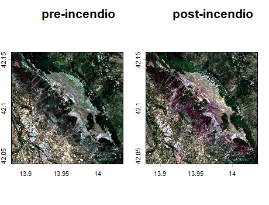
</p>

### - Visualizzazione in Falso Colore Infrarosso (NIR-Red-Green)
Per evidenziare visivamente l'impatto dell'incendio sulla copertura vegetale, è stata generata una composizione in falso colore
```r
im.multiframe(1, 2) 
im.plotRGB(pre, r=4, g=3, b=2, title="pre")
im.plotRGB(post, r=4, g=3, b=2, title="post")
```
> **Commento:**
> Dopo l'incendio la vegetazione (in rosso) è ridotta sul versante ovest del monte, maggiormente colpito dal rogo.
<p align="center">
 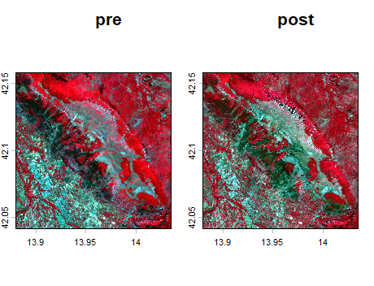
</p>


### - Visualizzazione e confronto delle singole bande spettrali (B2, B3, B4, B8)
Utilizzo il pacchetto `viridis` e la palette di colori `magma` per analizzare le variazioni di riflettanza pre e post-incendio.
```r
png("Bande.png", width = 2200, height = 1200, res = 220)  # salva il file direttamente su disco impostandone risoluzione e dimensioni
im.multiframe(2, 4)
par(mar = c(2.5, 2.5, 2, 0.5))  # riduce i margini esterni attorno a ciascun grafico

# PRE-INCENDIO
plot(pre[[1]], col = magma(100), main = "Pre - Blue (B2)", cex.main = 0.8) 
plot(pre[[2]], col = magma(100), main = "Pre - Green (B3)", cex.main = 0.8)
plot(pre[[3]], col = magma(100), main = "Pre - Red (B4)", cex.main = 0.8)
plot(pre[[4]], col = magma(100), main = "Pre - NIR (B8)", cex.main = 0.8)

# POST-INCENDIO
plot(post[[1]], col = magma(100), main = "Post - Blue (B2)", cex.main = 0.8)
plot(post[[2]], col = magma(100), main = "Post - Green (B3)", cex.main = 0.8)
plot(post[[3]], col = magma(100), main = "Post - Red (B4)", cex.main = 0.8)
plot(post[[4]], col = magma(100), main = "Post - NIR (B8)", cex.main = 0.8)

dev.off()
```
<p align="center">
 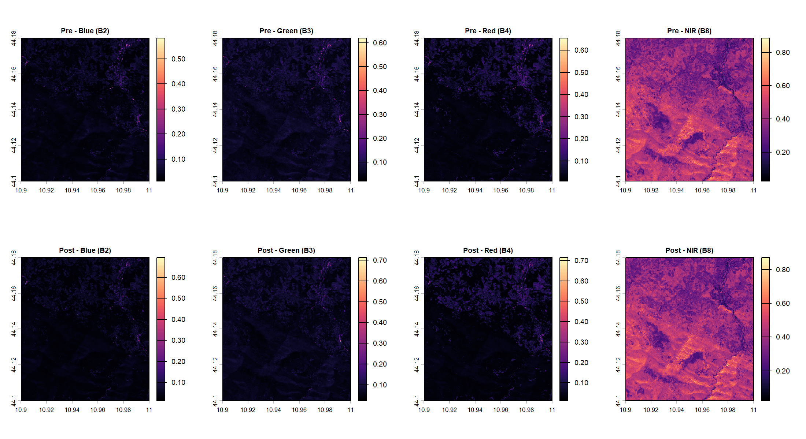
</p>

>**Commento:**
> Nel grafico del Vicino Infrarosso (B8, NIR) viene rilevato in modo netto l'impatto dell'incendio. Nella fase *Pre-incendio* la vegetazione sana presenta alti valori di riflettanza (aree chiare/gialle), mentre nella fase *Post-incendio* si osserva una diminuzione della riflettanza (area scura/viola), causato dalla perdita di biomassa fotosinteticamente attiva e dalla presenza di cenere/suolo bruciato.

# 4. Calcolo degli inidici vegetazionali  🌿

## Indice DVI
L'indice spettrale DVI (*Difference Vegetation Index*) permette di stimare la quantità e lo stato di salute della biomassa vegetale. Esso calcola la differenza algebrica tra la riflettanza nel Vicino Infrarosso (B8, NIR) e la riflettanza nel Rosso (B4, RED).
> Alti valori di DVI sono indici di una vegetazione sana e densa (alta riflettanza dell'infrarosso)
>
$$
DVI = NIR - RED
$$
>
Sono stati calcolati i DVI della fase pre e post incendio:
```r
dvi_pre <- pre[[4]] - pre[[3]]     # min value: -0.069; max value: 0.774
dvi_post <- post[[4]] - post[[3]]  # min value: -0.062; max value: 1.023
```
Successivamente è stata calcolata la variazione multitemporale, il **dDVI**:
```r
dDVI <- dvi_pre - dvi_post  # min value: -0.396; max value: 0.606 
```
> **Commento:**
> L'area presenta una netta eterogeneità: mentre la vegetazione indisturbata ha continuato la sua crescita (portando il DVI massimo oltre 1.0), le zone interessate dal fuoco hanno subito un crollo del segnale spettrale, evidenziato da valori di dDVI fortemente positivi (fino a +0.61).

Visualizzazione dei plot con la palette `viridis` per i DVI pre e post incendio e la palette `magma` per il dDVI
```r
im.multiframe(1, 3)
par(mar = c(3, 3, 3, 1))
plot(dvi_pre, col = viridis(100), main = "DVI Pre")
plot(dvi_post, col = viridis(100), main = "DVI Post")
plot(dDVI, col = magma(100), main = "dDVI (Pre - Post)")
```
<p align="center">
 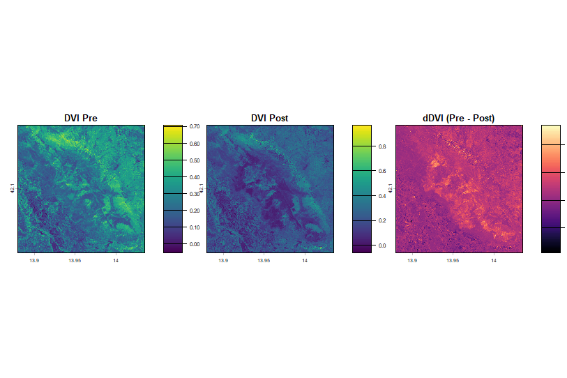
</p>

> **Commento:**
> * La mappa *Post-incendio* appare molto più scura al centro; il viola scuro e il blu indicano una drastica riduzione del DVI corrispondente alla perdita di biomassa vegetale e alla presenza di cenere e suolo bruciato.
> * Nella mappa del *dDVI*, le aree gialle/chiare (+0.4/+0.6) mostrano dove il DVI è crollato tra il prima e il dopo, permettendo di perimetrare meglio le area bruciate (cicatrice dell'incendio).


## Indice NDVI
L'indice NDVI (*Normalized Difference Vegetation Index*) rappresenta un indice DVI normalizzato, che riduce i disturbi dovuti a variazioni di illuminazione solare, ombre topografiche e pendenze del terreno (valori compresi tra -1 e +1).
> Alti valori di NDVI sono indici di una vegetazione sana; valori negativi o tendenti a zero indicano una vegetazione distrutta o suolo nudo.
> 
$$
NDVI = \frac{NIR - RED}{NIR + RED}
$$
>
Per il calcolo dell'NDVI pre e post incendio è stata usata la funzione `im.ndvi()` del pacchetto `imageRy`:
```r
ndvi_pre <- im.ndvi(pre, 4, 3)
ndvi_post <- im.ndvi(post, 4, 3)
```
In seguito è stata calcolata la variazione multitemporale, $dNDVI = NDVI_{pre} - NDVI_{post}$, per mappare con precisione il perimetro del bruciato e classificare i livelli di danno subiti dall'ecosistema forestale:
```r
dNDVI <- ndvi_pre - ndvi_post
```
Visualizzazione dei plot con la palette `viridis` per i NDVI pre e post incendio e la palette `magma` per il dNDVI
```r
im.multiframe(1, 3)
par(mar = c(3, 3, 3, 1))
plot(ndvi_pre, col = viridis(100), main = "NDVI Pre")
plot(ndvi_post, col = viridis(100), main = "NDVI Post")
plot(dNDVI, col = magma(100), main = "dNDVI (Pre - Post)")
```
<p align="center">
 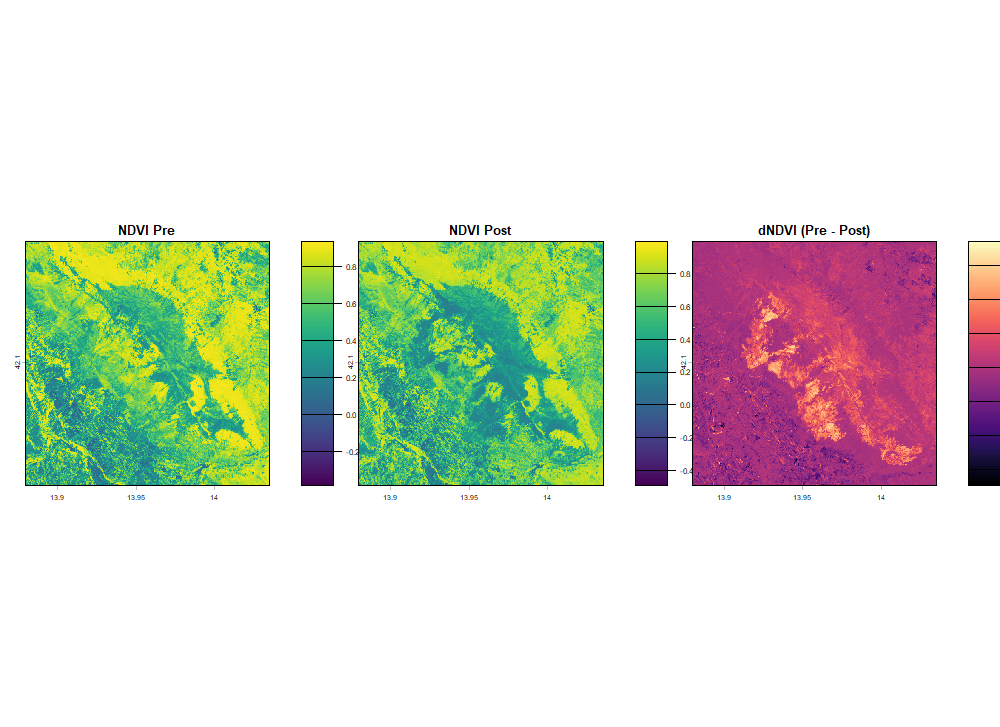
</p>

>**Commento:**
> Nella mappa *Post-incendio* si nota un drastico abbassamento dei valori, compresi tra **0.0 e 0.3** (verde scuro/blu) rispetto alla mappa *Pre-incendio*.
> La mappa *dNDVI* mostra le aree non colpite dal fuoco in colori scuri (valori intorno allo zero), mentre l'intera cicatrice dell'incendio risalta con tonalità chiare e accese (**dNDVI > +0.4**).

## Classificazione dei dati NDVI
Per la classificazione *non supervisionata* è stata utilizzata la funzione `im.classify()` del pacchetto `imageRy`
```r
ndvi_pre_c <- im.classify(ndvi_pre, num_clusters = 3, seed = 1)  # suddivisione dei pixel in tre gruppi
ndvi_post_c <- im.classify(ndvi_post, num_clusters = 3, seed = 1)
```
Le tre classi sono state rinominate attraverso la funzione `levels()` :
```r
levels(ndvi_pre_c) <- data.frame(
  value = c(1:3),
  label = c("Suolo Nudo", "Vegetazione sparsa", "Vegetazione densa")
)
levels(ndvi_post_c) <- data.frame(
  value = c(1:3),
  label = c("Suolo Nudo", "Vegetazione sparsa", "Vegetazione densa")
)
```
Visualizzazione dei dati NDVI classificati
```r
plot(ndvi_pre_c, main="NDVI Pre", col = c("#FFC107", "#9C27B0", "#2E7D32"), legend = FALSE)  #col=c() per colori personalizzati
plot(ndvi_post_c, main="NDVI Post", col = c("#FFC107", "#9C27B0", "#2E7D32"), cex.legend = 0.8)
```
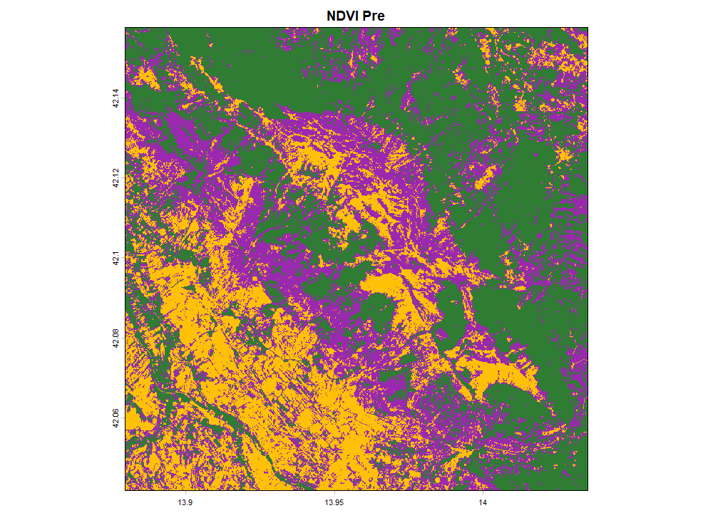 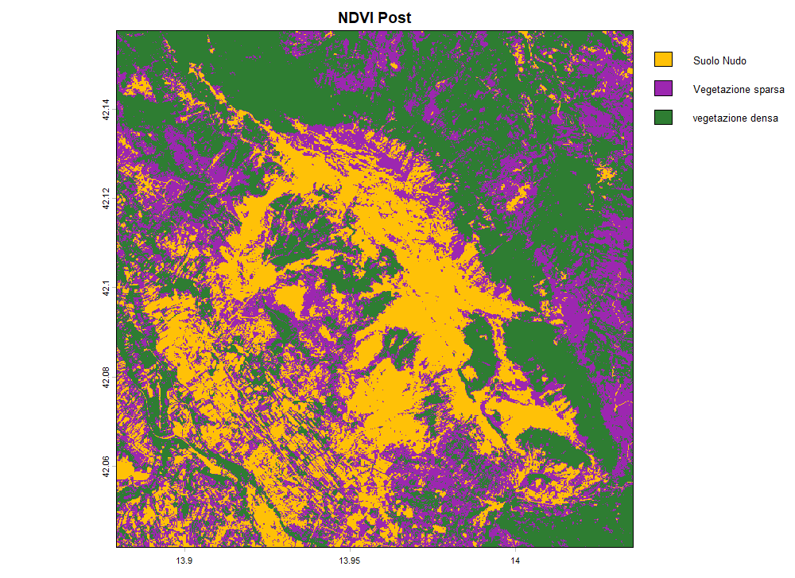

## Frequenze e Percentuali di copertura
```r
freq_pre <- freq(ndvi_pre_c)  # conta i pixel per ogni classe
perc_pre <- freq_pre$count * 100 / ncell(ndvi_pre_c)  # calcola la percentuale di pixel per classe

freq_post <- freq(ndvi_post_c) 
perc_post <- freq_post$count * 100 / ncell(ndvi_post_c)
```
Realizzazione della tabella riassuntiva
```r
tab <- data.frame(
  class=c("suolo nudo", "vegetazione sparsa", "vegetazione densa"),
  perc_pre = round(perc_pre, 1),
  perc_post = round(perc_post, 1)
)
print(tab)  # visualizza la tabella
```
| classi | % pre | % post |
| :--- | :---: | :---: |
| **suolo nudo** |  24.5 | 27.2 |
| **vegetazionesparsa** | 33.7 | 32.7 |
| **vegetazione densa** | 41.8 | 40.1 |

## Grafico a barre della copertura percentuale
Sono stat utilizzati i pacchetti `ggplot2` e `patchwork` per realizzare e visualizzare i grafici a barre relativi alle diverse coperture in percentuale delle tre classi, prima e dopo l'incendio.
```r
#PRE
g1 <- ggplot(tab, aes(x = class, y = perc_pre, color = class)) +    
  geom_bar(stat="identity", fill="white", show.legend = FALSE) +   # grafico a barre, stat="" definisce la statistica da usare
  ylim(c(0,100)) +
  labs(title = "Pre-Incendio", y = "Percentuale (%)") +
  theme(axis.text.x = element_blank(), axis.ticks.x = element_blank())  # rimuove il testo sotto l'asse x
#POST
g2 <- ggplot(tab, aes(x = class, y = perc_post, color = class)) +
  geom_bar(stat="identity", fill="white") +
  ylim(c(0,100)) +
  labs(title = "Post-Incendio", y = "Percentuale (%)") +
  theme(axis.text.x = element_blank(), axis.ticks.x = element_blank())

g1 + g2   # visualizza i grafici in un unico layout
```
> Grafico comparativo pre/post incendio
<p align="center">
 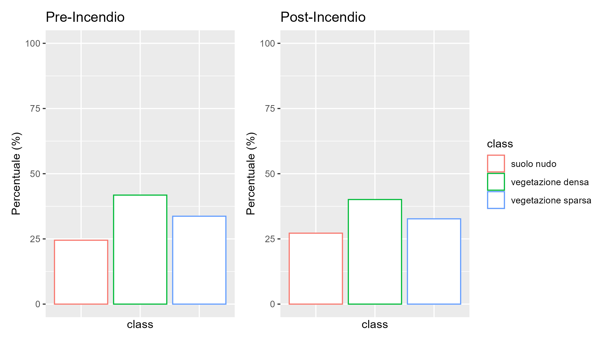
</p>

# 5. Analisi dopo un anno dall'incendio - Luglio 2018
Per studiare come e se la vegetazione sia tornata al suo stato di salute originale (pre-incendio), è stata analizzata un immagine satellitare corrispondente al periodo di luglio 2018.
Il procedimento è identico a quello precedente:

### Importazione e analisi dell'immagine
```r
post18 <- rast("sentinel2_jul2018.tif")
plot(post18)
```
<p align="center">
 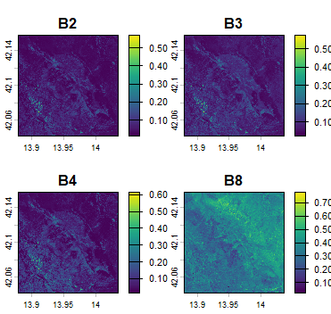
</p>

Visualizzazione del grafico in False colors
```r
im.plotRGB(post18, r=4, g=3, b=2, title="False colors 2018")
```
<p align="center">
 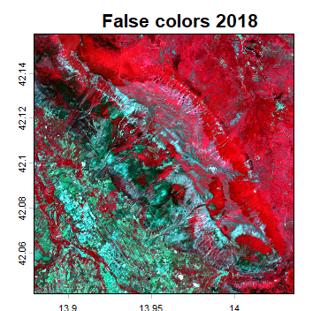
</p>

### Indice DVI (2018)
```r
# dvi_pre <- pre[[4]] - pre[[3]]   
dvi_post18 <- post18[[4]] - post18[[3]] 
dDVI <- dvi_pre - dvi_post18

# Layout
png("dvi2018.png", width = 2200, height = 1200, res = 220)

im.multiframe(1, 3)
par(mar = c(3, 3, 3, 1))
plot(dvi_pre, col = viridis(100), main = "DVI Pre")
plot(dvi_post18, col = viridis(100), main = "DVI 2018")
plot(dDVI, col = magma(100), main = "dDVI (Pre - 2018)")

dev.off()
```
<p align="center">
 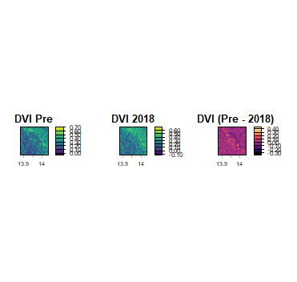
</p>

## Indice NDVI (2018)
```r
# ndvi_pre <- im.ndvi(pre, 4, 3)
ndvi_post18 <- im.ndvi(post18, 4, 3)
dNDVI <- ndvi_pre - ndvi_post18

#Layout
png("ndvi2018.png", width = 2200, height = 1200, res = 220)

im.multiframe(1, 3)
par(mar = c(3, 3, 3, 1))
plot(ndvi_pre, col = viridis(100), main = "NDVI Pre", cex.main = 1.2)
plot(ndvi_post18, col = viridis(100), main = "NDVI 2018", cex.main = 1.2)
plot(dNDVI, col = magma(100), main = "dNDVI (Pre - 2018)", cex.main = 1.2)

dev.off()
```
<p align="center">
 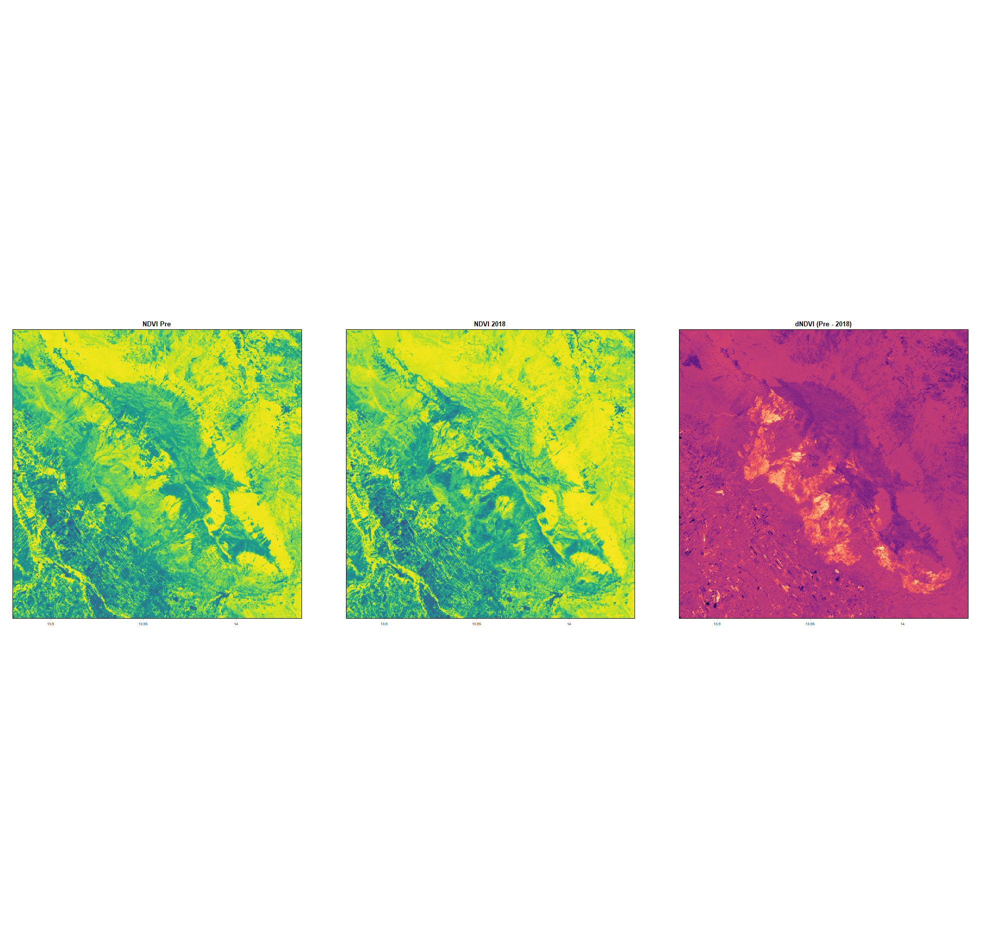
</p>

## Frequenze e percentuali
| class | % pre | % post | % 2018 |
|:--| :--: | :--:| :--:|
| **suolo nudo**  |   24.5  | 27.2 | 29.2 |
| **vegetazione sparsa**   |  33.7  | 32.7 | 21.2 |
|  **vegetazione densa**  |   41.8  | 40.1 |  49.6 |

